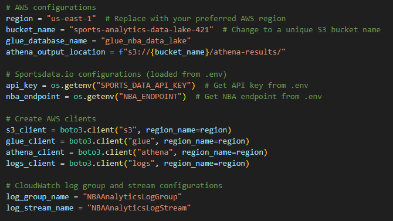
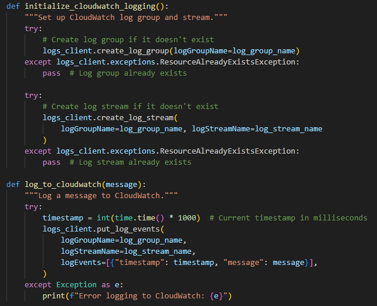
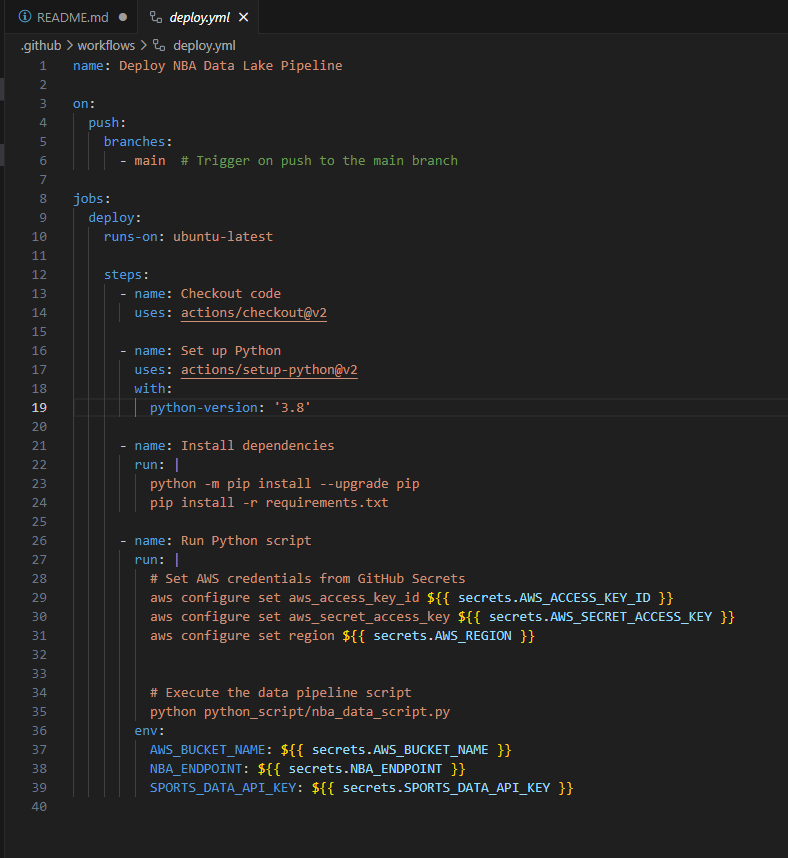
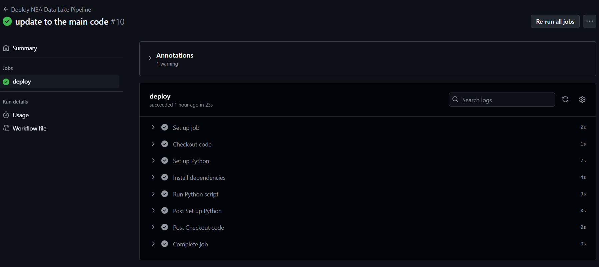
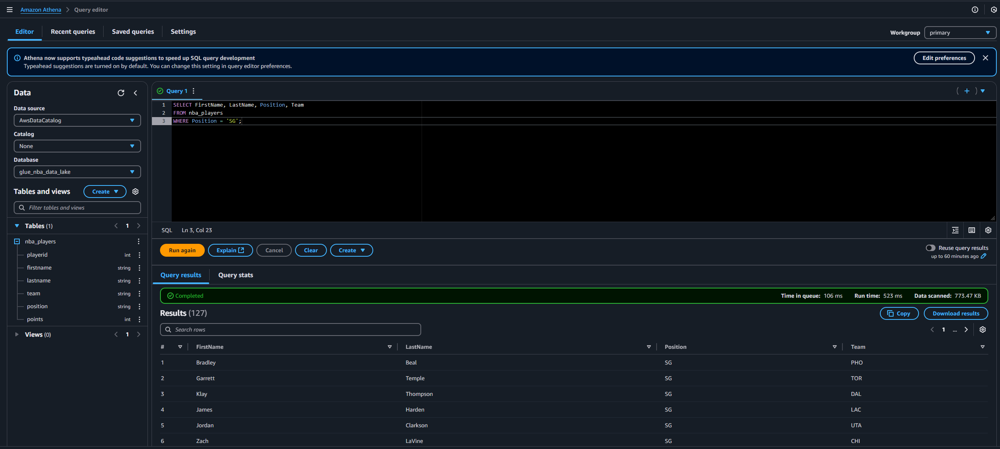
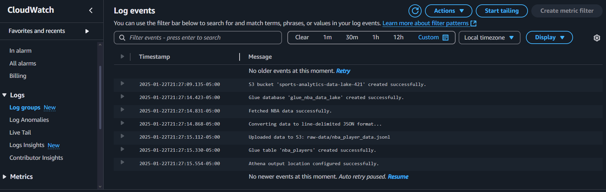

# NBA Data Lake Pipeline

Welcome to my 3rdproject in the Devops Challenge.
This project automates the process of collecting, storing, and analyzing NBA player data using AWS. It fetches data from the **Sportsdata.io API** and sets up a data lake in AWS for easy querying and analytics.

I once again decided to add my own challenge to the challenge by automating the process with github action, and logging it with cloudwatch.

---

## 🚀 What This Project Does

1. **Fetch NBA Data**: Gets player data from the Sportsdata.io API.
2. **Store Data in S3**: Saves the data in AWS S3 as JSON.
3. **Create a Data Lake**: Sets up AWS Glue for data organization.
4. **Enable SQL Queries**: Configures AWS Athena to query the data.
5. **Logs Everything**: Tracks all activities using AWS CloudWatch.

---

## 🛠️ Tools and Technologies

- **Python 3.8**
- **AWS**: S3, Glue, Athena, CloudWatch
- **Sportsdata.io**: NBA data API
- **GitHub Actions**: Automates deployment

---

## 📝 Setup Instructions

### Step 1: Prerequisites
- AWS account.
- IAM Role/Permissions: Ensure the user or role running the script has the following permissions:

S3: s3:CreateBucket, s3:PutObject, s3:DeleteBucket, s3:ListBucket Glue: glue:CreateDatabase, glue:CreateTable, glue:DeleteDatabase, glue:DeleteTable Athena: athena:StartQueryExecution, athena:GetQueryResults

- Sportsdata.io API key.
- Add these secrets to your GitHub repository (**Settings > Secrets and variables > Actions**):

| Secret Name             | Description                      |
|-------------------------|----------------------------------|
| `AWS_ACCESS_KEY_ID`     | AWS access key                  |
| `AWS_SECRET_ACCESS_KEY` | AWS secret access key           |
| `AWS_REGION`            | AWS region (e.g., `us-east-1`)  |
| `AWS_BUCKET_NAME`       | Your S3 bucket name             |
| `NBA_ENDPOINT`          | Sportsdata.io API endpoint      |
| `SPORTS_DATA_API_KEY`   | Sportsdata.io API key           |

---


### Step 2: How It Works

1. **Clone the Repo**
   ```bash
   git clone https://github.com/your-username/nba-data-lake-pipeline.git
   cd nba-data-lake-pipeline

# Push your code to the main branch.
This project is meant to run the python script automatically with all it's depencies in the github action which is located in the ".\github\workflows\deploy.yml"

**GitHub Actions will:** 
Set up AWS resources.
run the python script "nba_data_script.py" which does the following:
configuration and initialization for the AWS services.

Configuraion



initialization


Creation of the S3 bucket
Cretion of the Glue Databse
Fetching the NBA data.
Convert to Json format
uploading data to s3
Creating Glue Table "nba_players"
configuring athena for querrying


**Github action code**



### 📊 Results
Once the pipeline is complete:



S3 Bucket: Data is stored under the raw-data/ folder.
AWS Glue: Manages the data schema.
AWS Athena: Query the data using SQL.


**Example Query (Athena):**

SELECT FirstName, LastName, Position, Team
FROM nba_players
WHERE Position = 'SG';



**🛡️ Error Tracking**
CloudWatch Logs: Tracks all activities (e.g., S3 uploads, API calls).
Logs can help troubleshoot errors like missing API keys or AWS setup issues.




